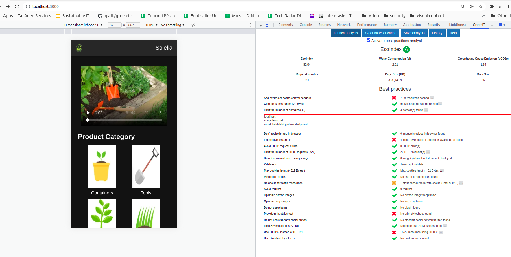
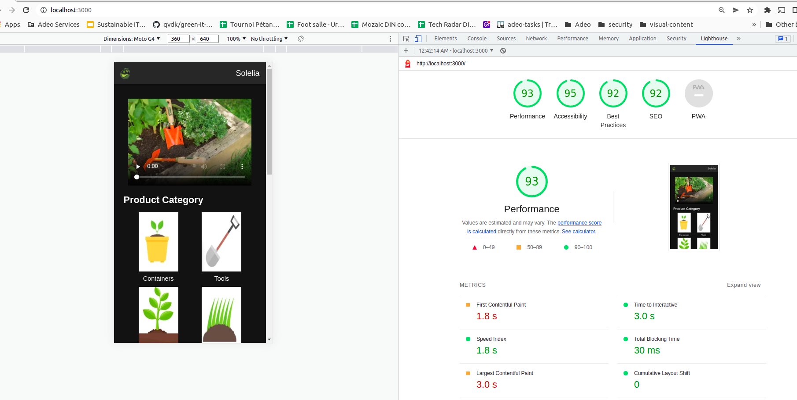

# solelia
Hackathon project for the Adeo DevSummit 2022 about the GreenIT.

[](https://docs.google.com/presentation/d/1gmZaVYzy-l5q2rMvK8p0Q_9E2OaMeI-AwZNi_yXCrAU/edit#slide=id.g6e4ab71bae_0_4)

We win the Gold Price 🏆🏆🏆 with this project. We prove it is possible to reduce our ecological impact by using GreenIT concepts with an advanced framework usable in a real world application.

Learn more about the concepts we applied in our introduction.
[](https://docs.google.com/presentation/d/1mAZgKVaVqy9z6aBRtAyvv9x_i-exKW4Zs2mWCj3lATs/edit?usp=sharing)

See more on [linkedin](https://www.linkedin.com/posts/quentin-vandekerckhove-6a06293a_thegreencompagnon-hackathon-ecoconception-activity-6945997982131499008-prGr?utm_source=linkedin_share&utm_medium=member_desktop_web)

This hackathon was organised with [#thegreencompagnon](https://www.linkedin.com/company/thegreencompagnon/?miniCompanyUrn=urn%3Ali%3Afs_miniCompany%3A71375305)

## GreenIT consideration

 * using NuxtJS framework in favor of SSR rendering to consider SEO
 * Video preview instead of including directly the video, no autoplay, no preload
 * disable NuxtJS link preload completly, see https://nuxtjs.org/docs/configuration-glossary/configuration-render/#resourcehints
 * format d'image optimisé : webp
 * image non redimensionné
 * contenu de texte écourté, serait afficher complétement sur une fiche production
 * galerie conseils départée dans une autre page
 * fournir une print CSS
 * LazyLoading sur les images hors de la ligne de flotaison
 * Utilisation des fonts presentes par defauts
 * Valider son code avec un linter
 * W3C Compliant






## Build Setup

```bash
# install dependencies
$ yarn install

# serve with hot reload at localhost:3000
$ yarn dev

# build for production and launch server
$ yarn build
$ yarn start

# generate static project
$ yarn generate
```

For detailed explanation on how things work, check out the [documentation](https://nuxtjs.org).

## Special Directories

You can create the following extra directories, some of which have special behaviors. Only `pages` is required; you can delete them if you don't want to use their functionality.

### `assets`

The assets directory contains your uncompiled assets such as Stylus or Sass files, images, or fonts.

More information about the usage of this directory in [the documentation](https://nuxtjs.org/docs/2.x/directory-structure/assets).

### `components`

The components directory contains your Vue.js components. Components make up the different parts of your page and can be reused and imported into your pages, layouts and even other components.

More information about the usage of this directory in [the documentation](https://nuxtjs.org/docs/2.x/directory-structure/components).

### `layouts`

Layouts are a great help when you want to change the look and feel of your Nuxt app, whether you want to include a sidebar or have distinct layouts for mobile and desktop.

More information about the usage of this directory in [the documentation](https://nuxtjs.org/docs/2.x/directory-structure/layouts).


### `pages`

This directory contains your application views and routes. Nuxt will read all the `*.vue` files inside this directory and setup Vue Router automatically.

More information about the usage of this directory in [the documentation](https://nuxtjs.org/docs/2.x/get-started/routing).

### `plugins`

The plugins directory contains JavaScript plugins that you want to run before instantiating the root Vue.js Application. This is the place to add Vue plugins and to inject functions or constants. Every time you need to use `Vue.use()`, you should create a file in `plugins/` and add its path to plugins in `nuxt.config.js`.

More information about the usage of this directory in [the documentation](https://nuxtjs.org/docs/2.x/directory-structure/plugins).

### `static`

This directory contains your static files. Each file inside this directory is mapped to `/`.

Example: `/static/robots.txt` is mapped as `/robots.txt`.

More information about the usage of this directory in [the documentation](https://nuxtjs.org/docs/2.x/directory-structure/static).

### `store`

This directory contains your Vuex store files. Creating a file in this directory automatically activates Vuex.

More information about the usage of this directory in [the documentation](https://nuxtjs.org/docs/2.x/directory-structure/store).
